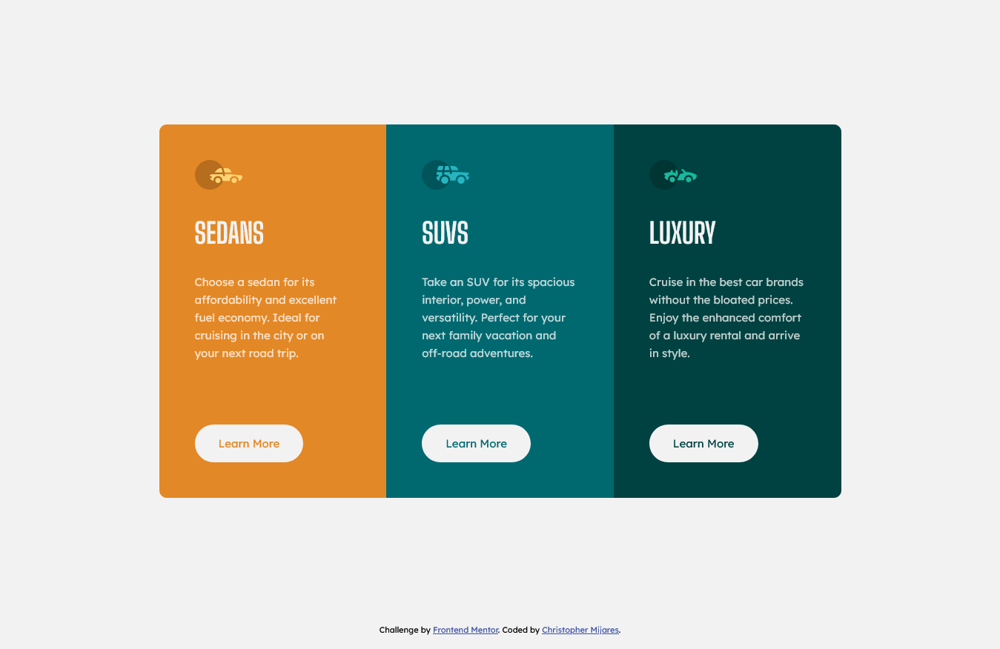

# Frontend Mentor - 3-column preview card component solution

This is a solution to the [3-column preview card component challenge on Frontend Mentor](https://www.frontendmentor.io/challenges/3column-preview-card-component-pH92eAR2-). Frontend Mentor challenges help you improve your coding skills by building realistic projects. 

## Table of contents

- [Overview](#overview)
  - [The challenge](#the-challenge)
  - [Screenshot](#screenshot)
  - [Links](#links)
- [My process](#my-process)
  - [Built with](#built-with)
  - [Useful resources](#useful-resources)
- [Author](#author)

## Overview

### The challenge

Users should be able to:

- View the optimal layout depending on their device's screen size
- See hover states for interactive elements

### Screenshot

### Links

- Solution URL: [https://www.frontendmentor.io/solutions/responsive-3-column-card-solution-with-css-grid-_JRoKMYMpV](https://www.frontendmentor.io/solutions/responsive-3-column-card-solution-with-css-grid-_JRoKMYMpV)
- Live Site URL: [https://my3columncardsolution.netlify.app/](https://my3columncardsolution.netlify.app/)

## My process

### Built with

- Semantic HTML5 markup
- CSS custom properties
- Flexbox
- CSS Grid
- CSS BEM
- Mobile-first workflow

### Useful resources

- [Perfect Pixel](https://www.welldonecode.com/perfectpixel/) - It's a helpful tool to match the most of the details of the design

## Author

- Frontend Mentor - [@cemijares23](https://www.frontendmentor.io/profile/cemijares23)
- Instagram - [@cmijares23](https://www.instagram.com/cmijares23)
